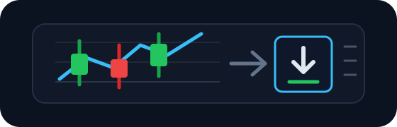

<p align="center">
  
</p>

<h1 align="center">Crypto OHLCV Fetcher</h1>

<p align="center">
  <b>A small Python CLI for downloading crypto candle data from Binance through ccxt and saving it as clean CSV files.</b>
</p>

<p align="center">
  
  
  
  
</p>

---

## 📖 What Crypto OHLCV Fetcher is

Crypto OHLCV Fetcher downloads historical candle data for the symbols and timeframes you define in `config.toml`.

It is meant for a simple research workflow: choose the market pairs, choose the candle intervals, choose the start date, then generate CSV files you can use in notebooks, backtests, dashboards, or trading experiments.

The project intentionally stays small. There is one CLI module, one config file, and one test file. No database, no web server, no pandas dependency, and no hidden setup.

---

## ⚙️ How it works

```text
config.toml
    |
    v
ccxt exchange client
    |
    v
OHLCV candle rows
    |
    v
Candle_Data/{SYMBOL}/{RUN_DATE}/{SYMBOL}_{TIMEFRAME}.csv
```

Example output path:

```text
Candle_Data/BTC/2026-09-28/BTC_USDT_1h.csv
```

Each CSV contains:

```text
timestamp,open,high,low,close,volume,date,time
```

---

## ✨ Features

- Fetch multiple crypto symbols in one run.
- Fetch multiple timeframes for each symbol.
- Configure the exchange, symbols, timeframes, start date, and output folder in TOML.
- Save each symbol/timeframe pair as a separate CSV file.
- Run once or repeat on an hourly schedule with `--every-hours`.
- Install and run with `uv`.
- Keep generated market data out of git.

---

## 🚀 Getting started

Install `uv` if it is not already installed:

```bash
curl -LsSf https://astral.sh/uv/install.sh | sh
```

From the project repo directory, install the locked dependencies:

```bash
uv sync
```

`uv` creates the local `.venv/` when it runs commands. The `.venv/` folder is ignored by git.

Optional smoke test:

```bash
uv run main.py --help
```

## 🧠 Agent skill

This repo includes an Anthropic-style skill at `skills/candle-vault/`.

Agents that support repository skills can use it to ask the `config.toml` setup questions, configure the project, install dependencies, and run the fetcher.

Example prompt:

```text
Install and use the Candle Vault skill from skills/candle-vault, then configure this repo and fetch BTC/USDT 1h candles since 2024-06-01.
```

---

## 🧾 Configuration

Open `config.toml` and fill in `symbols` and `timeframes`.

```toml
[fetch]
exchange = "binance"
symbols = ["BTC/USDT", "SOL/USDT"]
timeframes = ["5m", "15m", "1h", "4h", "12h", "1d"]
since = "2024-06-01T00:00:00Z"
output_dir = "Candle_Data"
```

| Field | Meaning |
|---|---|
| `exchange` | The ccxt exchange id. The default is `binance`. |
| `symbols` | Trading pairs to fetch, such as `BTC/USDT`. |
| `timeframes` | Candle intervals supported by the exchange, such as `5m`, `1h`, or `1d`. |
| `since` | The first candle timestamp to request, in UTC ISO-8601 format. |
| `output_dir` | Folder where generated CSV files are saved. |

The default `config.toml` keeps `symbols` and `timeframes` empty so you choose the markets before the first run.

---

## 🖥️ Usage

Fetch once:

```bash
uv run main.py --config config.toml
```

Fetch every hour:

```bash
uv run main.py --config config.toml --every-hours 1
```

Generated files are saved under `Candle_Data/`, which is ignored by git.

---

## 🧩 Project structure

```text
.
├── config.toml              # User-editable fetch settings
├── main.py                  # Root launcher for `uv run main.py`
├── pyproject.toml           # Project metadata, dependency, and CLI entry point
├── src/
│   └── main.py              # CLI, config loading, ccxt fetch, and CSV writing
├── tests/
│   └── test_main.py         # Small regression test for config and CSV row conversion
└── uv.lock                  # uv lockfile
```

---

## 🛠️ Development

Run the tests:

```bash
PYTHONPATH=src uv run python -m unittest discover -s tests
```

Compile-check the source:

```bash
uv run python -m compileall src
```

---

## 📝 Design notes

- `FetchConfig` is a small frozen dataclass because configuration is the only real data object.
- The app is a flat `src/main.py` module because this project does not need a package folder yet.
- CSV writing uses Python's standard library instead of pandas because the fetcher only writes rows to disk.
- `ccxt` is the only runtime dependency because exchange access is the only external behavior.
- `Candle_Data/` is ignored because generated market data should not be committed.

---

## 🔍 Worth knowing

- You need internet access when fetching market data.
- Binance is the default exchange, but any ccxt exchange id can be tried in `config.toml`.
- Empty `symbols` or `timeframes` will stop the run with a clear config error.
- This project fetches market data only. It does not place trades.

---

## 📄 License

MIT License. See [LICENSE](LICENSE).
